# Civilia Shinyproxy integration

# Objectif du projet

Le but du projet est de permettre l'ajout d'authentification pour les clients de Civilia devant les applications R Shiny développés pour rencontrer leurs besoins.

On suppose que les clients vont se connecter aux applications via l'adresse [client.civilia.ca](https://client.civila.ca/)

Le tout fonctionne avec les éléments qui suivent:

* Nginx sert de reverse-proxy devant Shinyproxy et permet de servir les applications par connexions https. 
* Certbot permet la gestion des certificats SSL de Let's Encrypt
* Shinyproxy s'occupe de lancer sur demande des containers utilisant ces images
* Les applications sont déployés dans une image Docker
* L'authentification est délégués par OpenID vers le service Auth0

Ce document explique comment mettre en place le tout sur le serveur de production. Certaines composantes étaient déjà en place lors du début du projet; leur mode d'installation sera donc expliqué au meilleur de mes connaissances mais sans avoir été testé (ex: Docker).

Les extraits de configurations données ici sont fonctionnelles dans un tout mais il est fort possible/probable qu'ils ne fonctionnent pas bien (voire pas du tout) s'ils sont testés en cours de route.

# Installation et configuration

Les composantes ont été mis en place sur un _droplet_ DigitalOcean avec les caractéristiques suivantes:
* 2 vcpu
* 4 GB ram
* Ubuntu Bionic 

## nginx

Le serveur web utilisé est nginx. Pour installer :

```
$ sudo apt-get install nginx
```

*Attention*: merci de vous assurer de désactiver le vhost default (ou sinon de voir à ce qu'il ne fasse pas de conflit avec les configurations qui suivent). Peut se faire avec un simple ``` rm /etc/nginx/sites-enabled/default```

Les configurations suivantes sont utilisés:

* nginx/nginx.conf => /etc/nginx/nginx.conf :
 Configuration très proche de la configuration par défaut de nginx. Vous avez fort probablement besoin de faire des ajustements pour votre configuration, ou mieux encore, simplement vous assurer que votre configuration va bel et bien charger les configurations qui suivent (comme c'est normalement le cas par défaut sur Ubuntu). 
* nginx/conf.d/proxy.conf : 
comportement par défaut du proxy. Pourrait être simplement répété dans la configuration du vhost, mais plus propre lorsque gardé séparé
* nginx/sites-available/client.civilia.ca.conf => /etc/nginx/sites-available/client.civilia.ca.conf :
 la configuration du vhost client.civilia.ca. 
 Activer avec un lien symbolique, ex:

```
cd /etc/nginx/sites-enabled/
ln -s /etc/nginx/sites-available/client.civilia.ca.conf client.civilia.ca.conf
```

## certbot - https

Certbot permet l'automatisation du renouvellement des certificats SSL avec Let's Encrypt

Les [instructions officielles](https://certbot.eff.org/lets-encrypt/ubuntuother-nginx) d'installation officielle pour Ubuntu sont très claire et ne sont pas répétés ici.

En bref, ce qui va être fait:

* ```sudo certbot --nginx``` : configure certbox automatiquement pour la configuration nginx active.
* ```sudo certbot renew --dry-run``` : Fait la vérification du processus de renouvellement (le --dry-run est pour éviter de parler pour vrai aux serveurs de Let's Encrypt puisqu'il y a des limites sur le nombre d'appels)
* Une entrée de crontab va être créé dans /etc/cron.d/certbot et va s'assurer de renouveller le certificat lorsque nécessaire. C'est une bonne idée de vérifier qu'elle est bien là

Les visites vers [https://client.civilia.ca](client.civilia.ca) vont maintenant être chiffrées avec SSL.

Remarque: la page de Certbot suggère de visiter https://www.ssllabs.com/ssltest/ pour vérifier le bon fonctionnement. La note obtenu n'est pas "parfaite" parce que Certbot laisse en place des configurations avec des versions de TLS et de cyphers plus anciennes pour compatibilité. 


## Shinyproxy

Shinyproxy: site officiel https://www.shinyproxy.io/

### Installation

Il est possible d'installer Shinyproxy avec Docker. Par contre, comme le proxy va lui-même être utilisé pour contrôler Docker il est nécessaire d'exposer le daemon docker à l'intérieur d'un container. Cette pratique est possible mais peut être considéré plus ou moins sécuritaire. J'ai donc choisi d'installer Shinyproxy directement sur le serveur.

On doit d'abord s'assurer que java est installé. La version qui était déjà installé au moment de débuter le projet est openjdk-11; installer le package default-jre est probablement suffisant:

```
sudo apt-get install default-jre-headless
```

Pour l'installation on installe avec le package .deb  qui automatise beaucoup de chose par rapport au .jar:

```
# non testé!
wget https://www.shinyproxy.io/downloads/shinyproxy_2.3.0_amd64.deb
dpkg -i shinyproxy_2.3.0_amd64.deb
```

Il est possible/probable que le processus d'installation essait de lancer shinyproxy et fini avec un erreur.

Shinyproxy roule par defaut sur le port 8080, qui est... toujours pris. Pour changer le port, on va ajuster la configuration.

L'installation de shinyproxy devrait aussi avoir configuré le daemon Docker pour que shinyproxy puisse lui parler.

Voir le fichier /etc/systemd/system/docker.service.d/override.conf qui devrait ressembler à ça:

```
[Service]
ExecStart=
ExecStart=/usr/bin/dockerd -H unix:// -D -H tcp://127.0.0.1:2375
```

### Configuration

La configuration de shinyproxy se fait dans le fichier /etc/shinyproxy/application.yml qui est (assez bien!) [documenté ici](https://www.shinyproxy.io/configuration/)

Copier le fichier shinyproxy/application.yml vers /etc/shinyproxy/application.yml  et redémarrer shinyproxy.

Plutôt que d'alourdir cette page j'ai plutôt choisi de commenter abondammer le fichier de configuration lui-même.

Le fichier shinyproxy/application-simplelogin.yml contient une configuration simple sans OpenID si vous voulez tester l'installation jusqu'à maintenant.

### Utilisation

Le déploiement d'une Shiny App est expliqué dans la page [deploying app](https://www.shinyproxy.io/deploying-apps/).

Les tests ont été fait avec l'image de tests fourni par le projet et en buildant une l'image du Dockerfile donné en exemple.


## Auth0 - authentification

[Auth0](https://auth0.com/) offre une plateforme qui permet la gestion d'identité à travers divers langages, protocoles et fournisseur d'identité, de l'identitié plsu "entreprise" comme avec ActiveDirectory comme l'identité "sociale" avec Facebook, Twitter, Google, etc.

La plateforme développeur est gratuite et permet de gérer de petits groupes d'usagers dans sa propre base de données intégrés.

### configuration de l'application dans Auth0

Voici les étapes pour configurer Auth0 :

Création de l'application:

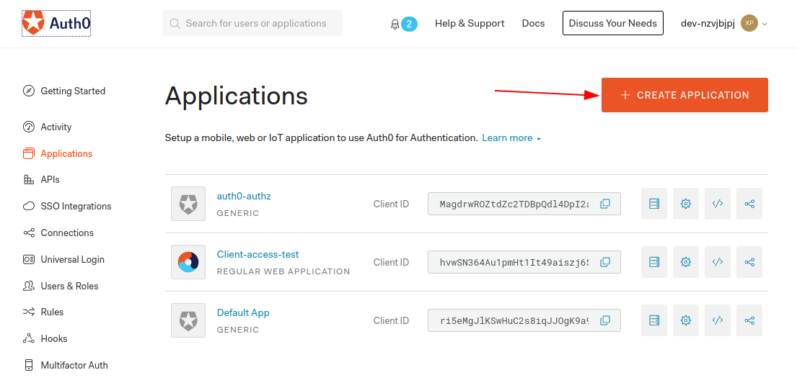

On choisit type "Web"

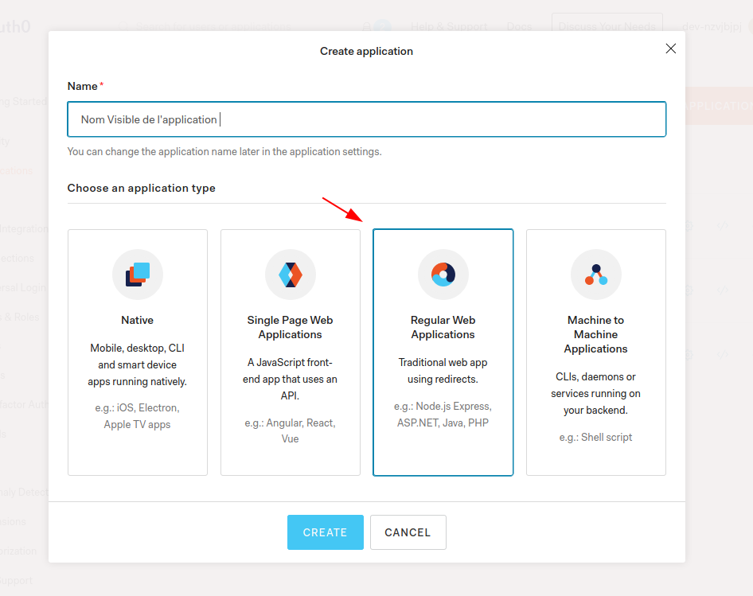

L'application est créé. On nous demande pour quelle plateforme on veut déployer

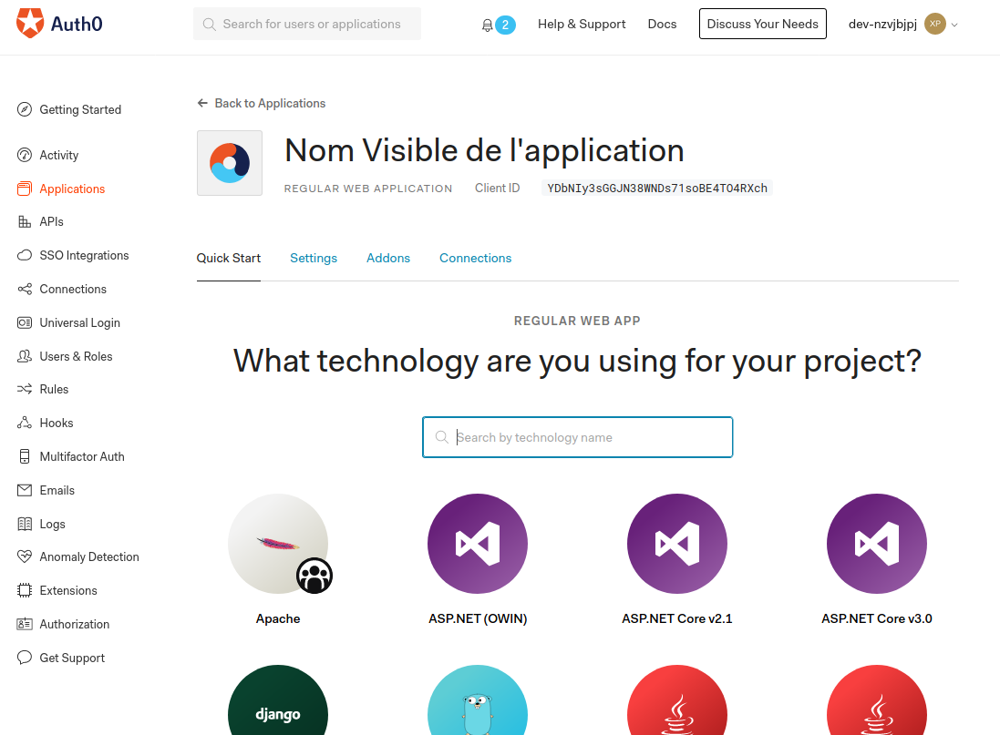


La plateforme n'est pas très importante ; on a choisi Python mais ça sert essentiellement à nous guider pour développer des applications qui utilisent la plateforme Auth0

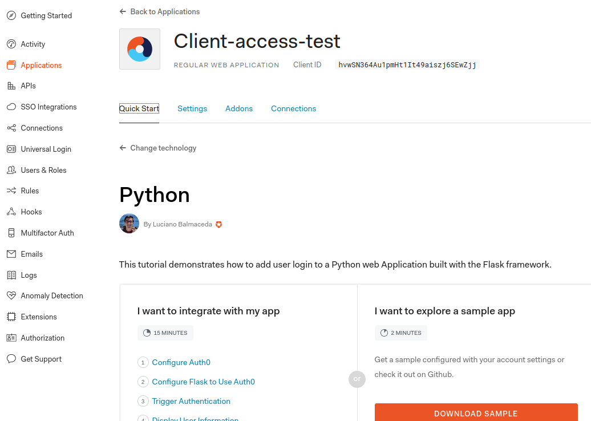

Configuration de base. A noter:

* Le domaine correspond au nom du compte
* le eu.auth0.com veut dire qu'on utilise la plateforme Européenne
* le client ID va être utiliser dans la configuration ; c'est un peu comme le "username" de cette application
* le client Secret est... un secret. Il a été mis en clair dans la configuration mais je recommanderais de ne pas le garder dans du controle de source

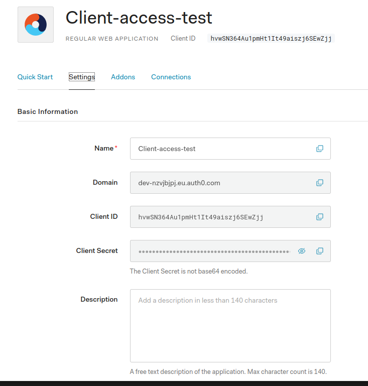

Seul élément important ici: la configuration du logo. A noter qu'il est important que le logo soit servi par https pour éviter des avertissement du navigateur.

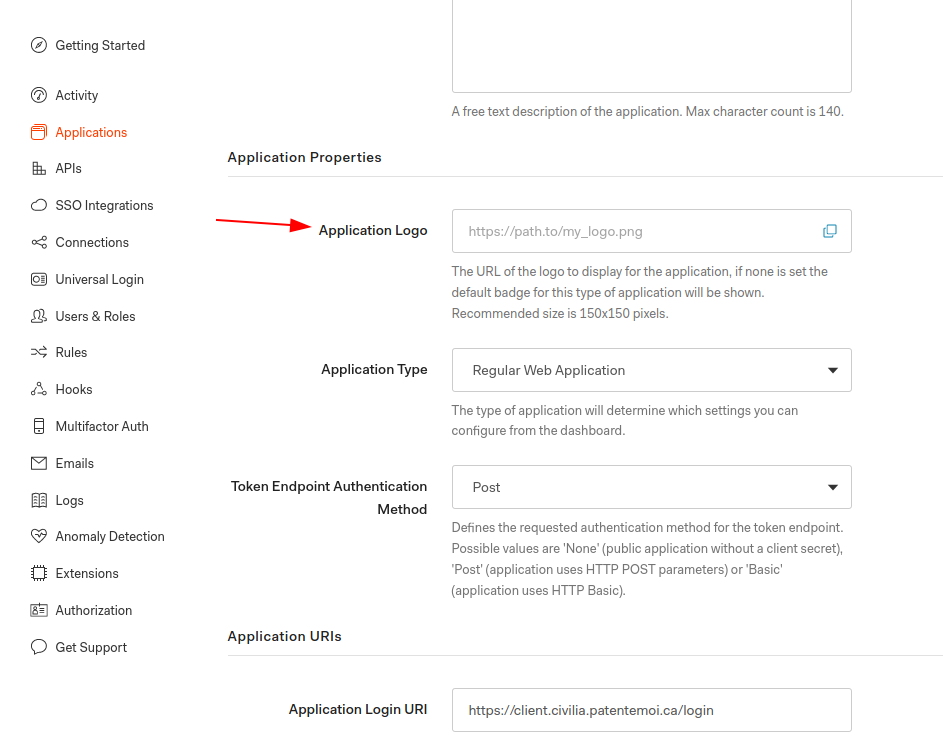

Configuration de "l'app" auth0 proprement dit.

* Application Login URI: l'adresse dans Shinyproxy qui prend en charge le login. C'est https//nomdedeomaine/login
* Allowed Callback URLs: les URLs vers lesquels ont peut rediriger après authentification dans Auth0. Dans notre cas on veut uniquement aller vers l'app Shinyproxy
* Allowed Logout URL: En principe on liste les adresses qui ont le droit d'aller dans le paramètres returnTo; sert à rediriger le client vers une page après s'être déconnecté. Je ne réussissais pas à bien l'utiliser; il y a peut-être un bug dans Shinyproxy.... combiné à une erreur dans la configuration quelque part. Contourné en utilisant une redirection avec en paramètre le _clientid_, où dans ce cas Auth0 utilise le *premier* url de cette liste


### Intégration avec Shinyproxy

L'authentification avec Auth0 / un provider OpenID est documenté dans [cette section](https://www.shinyproxy.io/configuration/#openid-connect-oidc) de la documentation officielle.

La documentation est par bout un peu difficile à suivre puisqu'elle couvre à la fois un provider OpenID "générique" et les configurations propres à un provider précis. La configuration présente dans shinyproxy/application.yml est fonctionnelle après avoir démêler le tout.

Pour trouver les bons URL pour votre application:

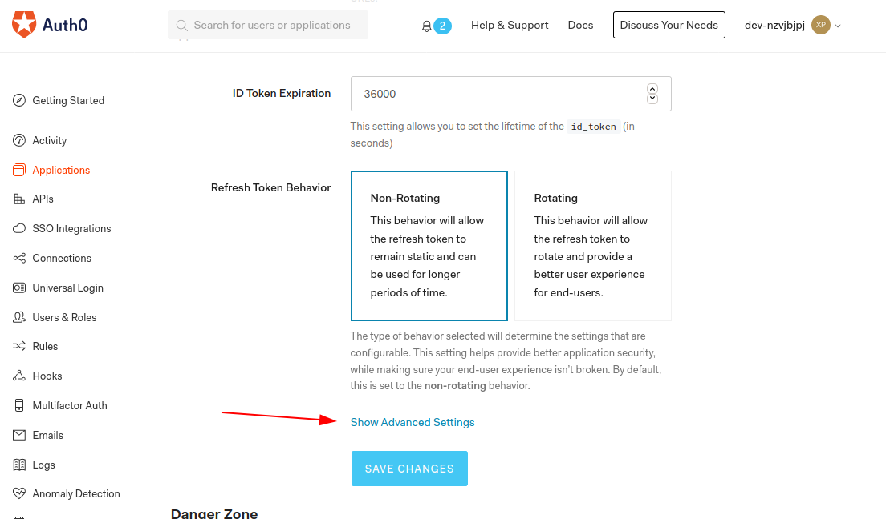

Et pour trouver les endpoints:

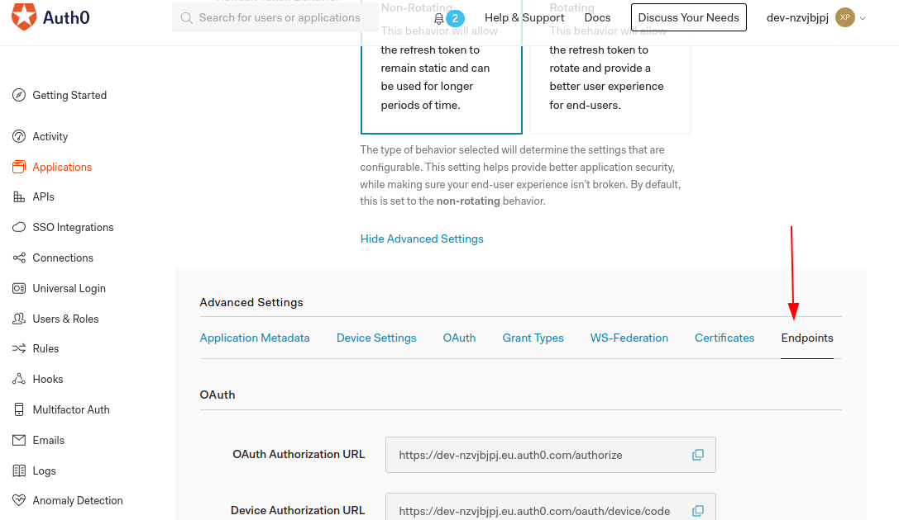


# Utilisation

## Création des usagers


On gère les usagers en utilisant une database Auth0:

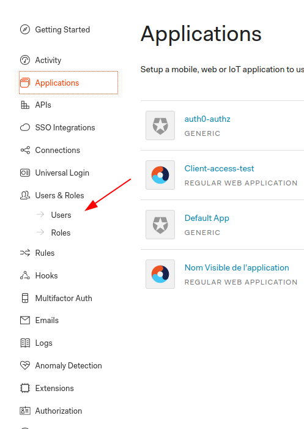

Pour créer un usager:

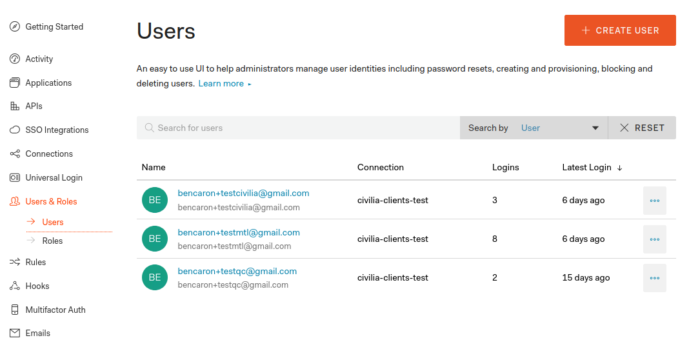

Il faut s'assurer d'associer l'usager à la bonne application:

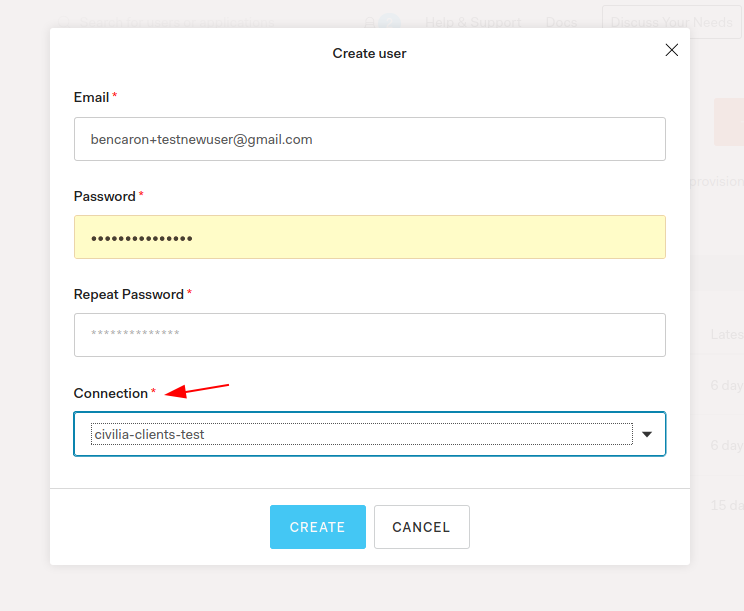

### Configuration des groupes 

*Attention* on doit faire une règle particulière pour utiliser des groupes en attachant du metadata à la session de l'usager lorsqu'il retourne vers Shinyproxy, tel que documenté [ici](https://www.shinyproxy.io/configuration/#auth0)

Dans la page du détail d'un usager:

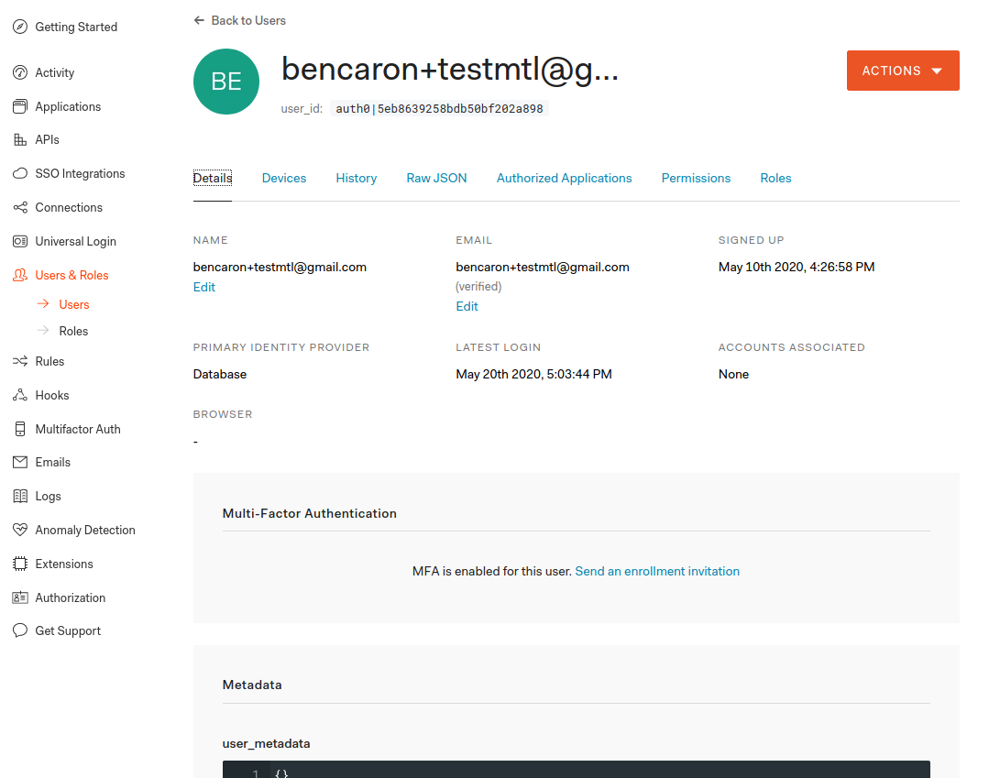

Tout en bas on va ajouter les groupes avec un petit bout de JSON

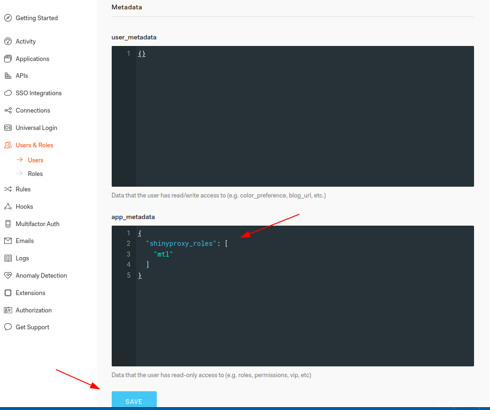

Pour être membre de plusieurs groupes:

```json
{
  "shinyproxy_roles": [
    "mtl", "qc"
  ]
}
```

Pour un seul groupe (par exemple le groupe *civilia* qui est le groupe admin):  

```json
{
  "shinyproxy_roles": [
    "civilia"
  ]
}
```


Et pour l'attacher à la session on l'ajoute aux "customs rules":

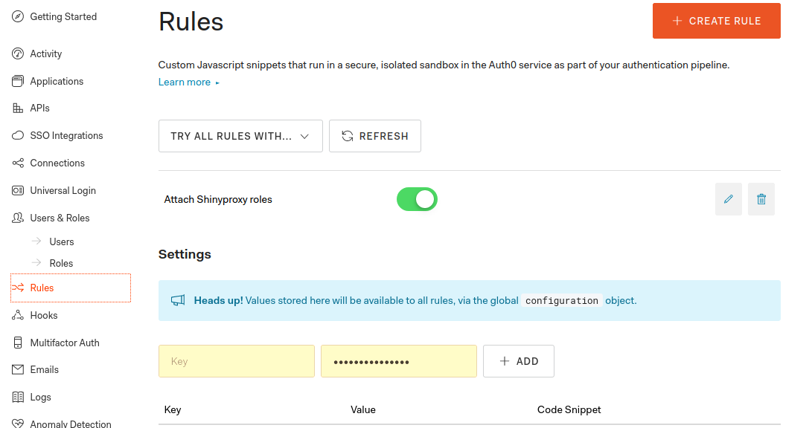

Avec la règle en place:

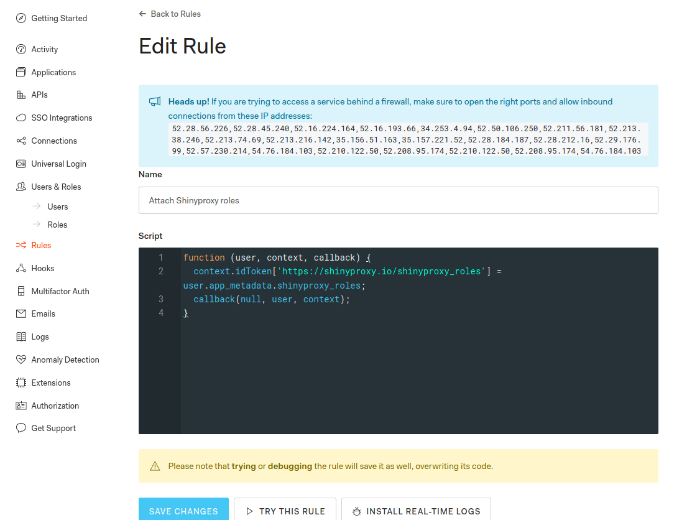

Le code javascript nécessaire se retrouve dans la documentation de Shinyproxy mentionné plus haut ; le code est très simple:

```js
function (user, context, callback) {
  context.idToken['https://shinyproxy.io/shinyproxy_roles'] = user.app_metadata.shinyproxy_roles;
  callback(null, user, context);
}
```

La nom du Token ('https://shinyproxy.io/shinyproxy_roles')  doit correspondre à la configuration _roles-claim_ dans le fichier /etc/shinyproxy/application.yml


# civilia-shiny
